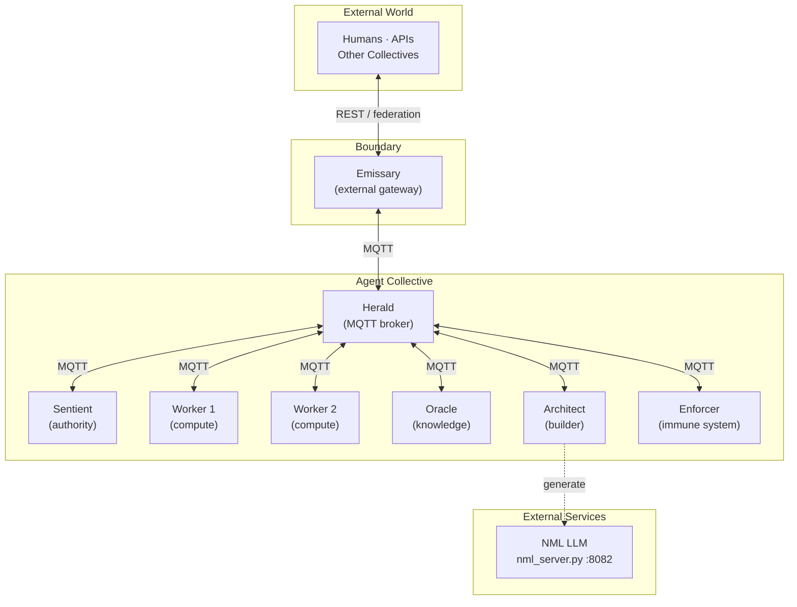
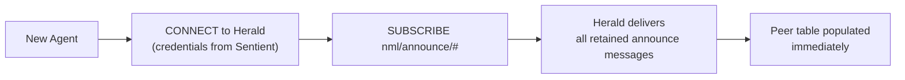
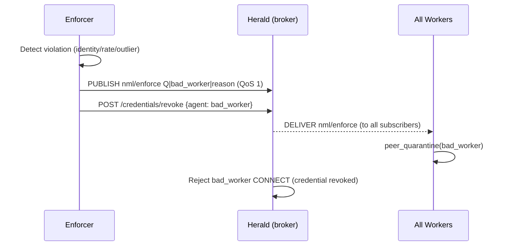
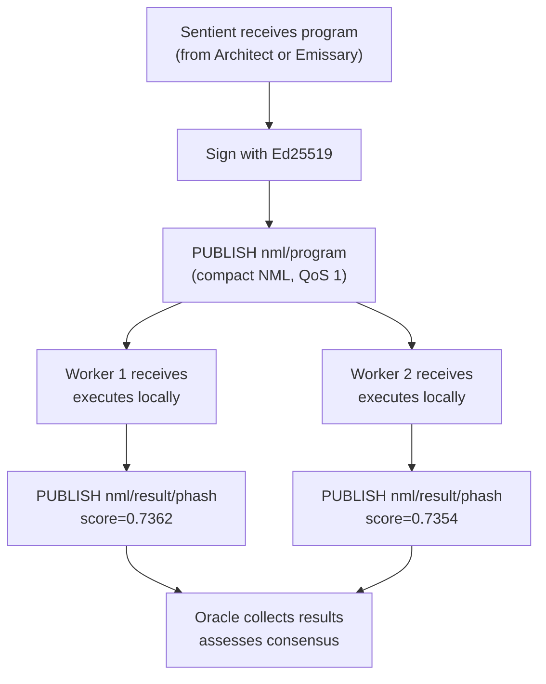
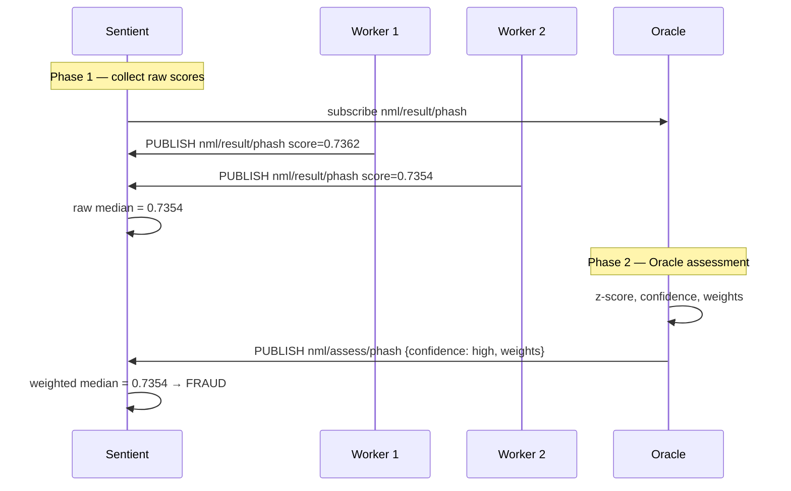
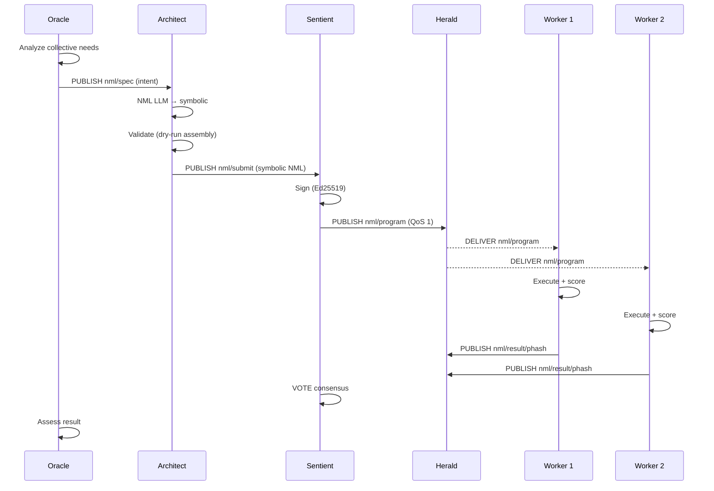
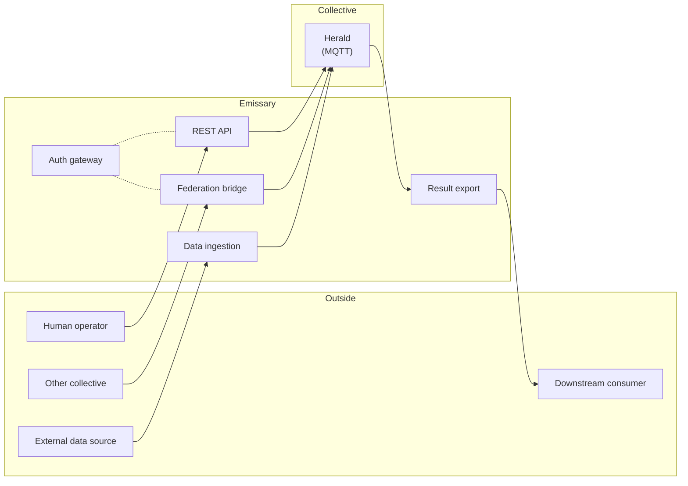
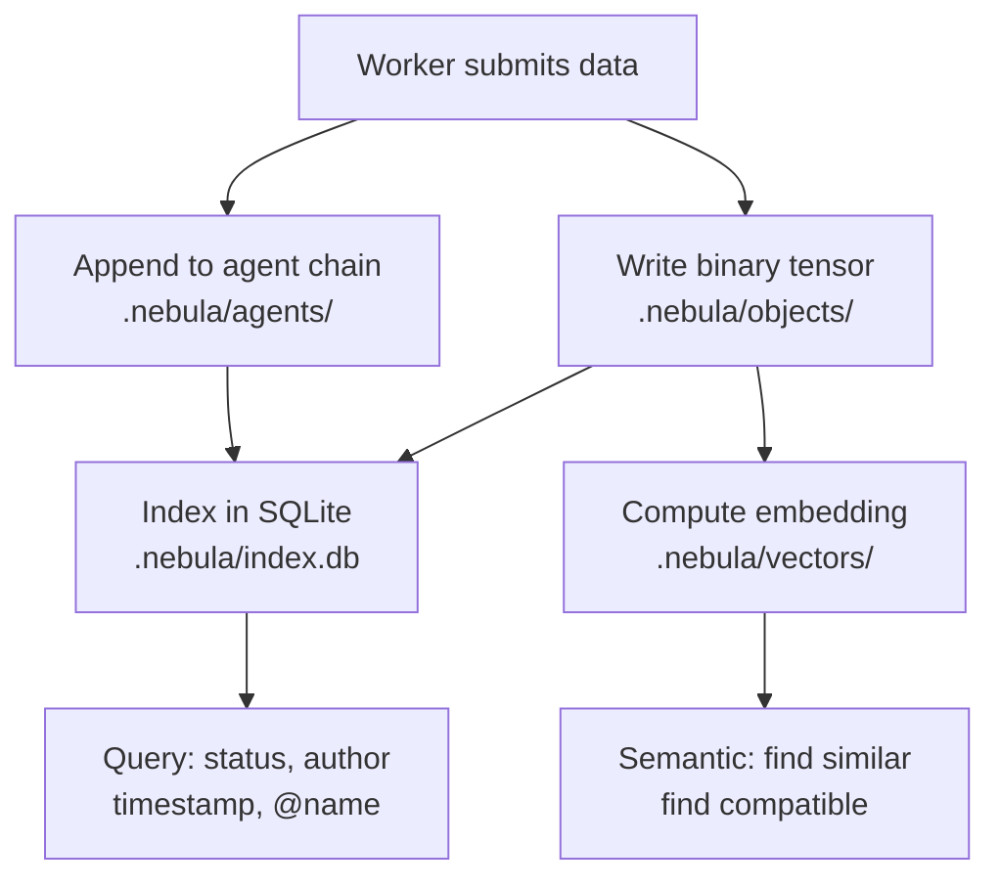

# NML Collective — Architecture

## Overview

The NML Collective is a decentralized agent mesh where autonomous peers discover each other, broadcast signed NML programs, execute them locally, and reach consensus — with no central orchestrator.



**Key principle:** Every agent is a peer with a specialized role. There is no leader among the agents. Kill any agent and the rest continue operating. The Herald can be clustered for high availability.

### Seven Roles

| Role | Purpose | Signs | Executes | Votes on Data | Special |
|------|---------|-------|----------|---------------|---------|
| [**Sentient**](ROLE_SENTIENT.md) | Authority — signs programs, approves data, embeds Nebula | Yes | Yes | Yes | Overrides enforcers |
| [**Worker**](ROLE_WORKER.md) | Compute — executes programs, submits data, reports results | No | Yes | No | — |
| [**Oracle**](ROLE_ORACLE.md) | Knowledge — observes all, answers questions, assesses consensus | No | No | Yes (analysis) | Generates specs |
| [**Architect**](ROLE_ARCHITECT.md) | Builder — generates NML from specs via NML LLM, validates | No | Dry-run | No | Ships symbolic |
| [**Enforcer**](ROLE_ENFORCER.md) | Immune system — quarantines nodes, maintains bans, collects evidence | No | No | No | Gossips bans |
| [**Herald**](ROLE_HERALD.md) | Mesh infrastructure — MQTT broker, credentials, ACLs, health | No | No | No | Brokers all traffic |
| [**Emissary**](ROLE_EMISSARY.md) | External boundary — human API, inter-collective federation | No | No | No | Only external contact |

See the individual role documents for full details.

---

## Transport — MQTT

All agent-to-agent communication flows through the Herald MQTT broker. Agents publish to topics and subscribe to topics they care about. No agent communicates directly with another.

### Topic Map

| Topic | Publisher | Subscribers | QoS | Retained |
|-------|-----------|-------------|-----|----------|
| `nml/announce/<name>` | Each agent on connect | All agents | 1 | Yes |
| `nml/program` | Sentient, Architect | Workers | 1 | No |
| `nml/result/<phash>` | Workers | Oracle, Sentient | 1 | No |
| `nml/heartbeat/<name>` | Each agent | Enforcer, Oracle | 0 | No |
| `nml/enforce` | Enforcer | All agents | 1 | No |

**Retained presence:** each agent publishes its announce to `nml/announce/<name>` with `retain=true` and an empty-payload **Last Will** on the same topic. Any agent that joins after the fact immediately receives the current peer list from the broker — no ANNOUNCE round-trip needed.

**Last Will:** when an agent connects to the Herald it registers a will: publish empty payload to `nml/announce/<name>` retained. On ungraceful disconnect the broker clears the retained message automatically, removing the departed agent from new joiners' view.

### QoS Policy

| Message type | QoS | Rationale |
|-------------|-----|-----------|
| ANNOUNCE / presence | 1 | Must be delivered; drives peer table |
| PROGRAM | 1 | Lost program = missed execution round |
| RESULT | 1 | Lost result = incomplete consensus |
| HEARTBEAT | 0 | Frequent, loss tolerable |
| ENFORCE | 1 | Quarantine decisions must propagate |

---

## Discovery

With MQTT, discovery is a side effect of subscription rather than a separate protocol layer.



1. Agent receives credentials from the Sentient (or is pre-configured)
2. Agent connects to Herald with those credentials
3. Agent subscribes to `nml/announce/#`
4. Herald delivers all retained announce messages — agent learns all current peers immediately
5. Agent publishes its own `nml/announce/<name>` with retain — all existing agents learn of it

No polling. No seed URLs. No multicast group. No mDNS.

---

## Enforcement over MQTT

The Enforcer subscribes to `$SYS/` broker metrics published by Mosquitto/EMQX, and to `nml/heartbeat/#` and `nml/result/#` for behavioral monitoring. When it quarantines a node it publishes to `nml/enforce` (QoS 1) and instructs the Herald to revoke the node's credentials. All agents receive the enforce message and drop the node from their peer tables.



---

## Broadcast Protocol

When a Sentient receives a program it publishes to `nml/program`. Workers subscribed to that topic execute it and publish results to `nml/result/<phash>`.



### Deduplication

Programs are identified by `SHA-256(program)[:16]` (first 16 hex chars). Once a hash is seen, the program is never re-executed. The MQTT broker's QoS 1 guarantees delivery without re-execution — deduplication is only needed if the same program is submitted multiple times by different sources.

---

## Packet Format (wire compatibility)

The internal wire format used by C99 agents over MQTT payloads mirrors the original UDP format, preserving interoperability with the Python layer during transition:

```
┌─────────┬──────┬──────────┬────────┬──────────┬──────────────────────┐
│ Magic   │ Type │ Name Len │  Name  │  Port    │  Payload             │
│ 4 bytes │ 1 B  │  1 B     │  N B   │  2 B BE  │  variable            │
│ NML\x01 │      │          │        │          │                      │
└─────────┴──────┴──────────┴────────┴──────────┴──────────────────────┘
```

| Message Type | Code | Payload |
|-------------|------|---------|
| ANNOUNCE | 1 | `<machine_hash16>:<node_id16>` |
| PROGRAM | 2 | Compact NML (pilcrow-delimited) |
| RESULT | 3 | `{hash}:{score}` |
| HEARTBEAT | 4 | `<machine_hash16>:<node_id16>` |
| ENFORCE | 5 | `<type>\|<target>\|<reason>` |

### Size Example

| | Classic | Symbolic Compact | MQTT Payload |
|---|---|---|---|
| Fraud detection (23 instr) | 1,985 B | 340 B | 348 B |
| Fits in 1 packet? | No | **Yes** | **Yes** |

---

## Two-Phase Consensus (VOTE)

Any agent can initiate consensus. If an Oracle is in the mesh, the result includes assessment and weights.



**Phase 1:** Raw scores collected via `nml/result/<phash>` subscriptions.
**Phase 2:** Oracle publishes assessment to `nml/assess/<phash>` — confidence scoring, per-agent weights, outlier flags.

Strategies: `median` (default), `mean`, `min`, `max`.

---

## Program Pipeline

The full lifecycle from intent to execution:



---

## External Boundary (Emissary)

All traffic crossing the collective boundary — human operators, other collectives, external data sources, downstream consumers — goes through the Emissary. Internal agents are never directly exposed.



---

## Signing and Verification

Programs are signed before distribution. Every agent verifies before execution.


- **Ed25519:** Private key stays local. Only public key in the header. 64-byte signature.
- **HMAC-SHA256:** Backward-compatible for trusted networks.
- **Tamper detection:** Any modification to the program body invalidates the signature.

---

## Node Identity

Every C99 agent derives a tamper-evident identity at startup:

```
machine_hash = SHA-256(hw_uid)[0:8]       — bound to physical hardware
node_id      = SHA-256(machine_hash || ':' || agent_name)[0:8]
payload      = "<machine_hash16>:<node_id16>"   — carried in ANNOUNCE/HEARTBEAT
```

The Enforcer re-derives `node_id` from `(machine_hash, agent_name)` on every ANNOUNCE. A mismatch means the payload was tampered. Two agents claiming the same `machine_hash` triggers a one-node-per-machine violation.

---

## File Structure

```
edge/                          C99 base library (libcollective.a)
  config.h                     Compile-time configuration
  udp.c / udp.h                UDP multicast (legacy / embedded)
  msg.c / msg.h                Wire format encode/decode
  crypto.c / crypto.h          Ed25519 signature verification
  identity.c / identity.h      Tamper-evident node identity
  peer_table.c / peer_table.h  Fixed-size peer registry with IP + role
  vote.c / vote.h              Two-phase VOTE aggregation
  report.c / report.h          Result reporting (UDP / HTTP)
  program_send.c               Program broadcast helpers
  http_client.c / http_client.h  Blocking HTTP GET (data fetch)
  nml_exec.c / nml_exec.h      In-process NML execution

roles/
  worker/      worker_agent.c    Execute programs, fetch data on demand
  sentient/    sentient_agent.c  Data management, program distribution
  oracle/      oracle_agent.c    Consensus assessment, z-score
  architect/   architect_agent.c Program composition and signing
  enforcer/    enforcer_agent.c  Identity verification, behavioral policy
  herald/      herald_agent.c    MQTT broker supervision, credentials, ACLs
  emissary/    emissary_agent.c  External boundary, REST API, federation

serve/                         Python reference implementation
  nml_collective.py            Autonomous gossip agent (all roles)
  nml_oracle.py                Oracle knowledge engine
  nml_architect.py             Architect program builder
  nml_nebula.py                Nebula ledger
  nml_storage.py               Three-layer storage
  nml_enforcer.py              Enforcer immune system

docs/
  ARCHITECTURE.md              This document
  SYSTEM_ARCHITECTURE.md       Full 7-layer stack, data flow, metrics
  NEBULA_DESIGN.md             Storage design, quarantine, data lifecycle
  ROLE_*.md                    Individual role specifications
```

---

## Nebula Storage

The nebula persists all data across three layers. Only Layer 1 is truth — Layers 2 and 3 are derived and rebuildable.



| Layer | Purpose | File | Rebuildable? |
|-------|---------|------|-------------|
| 1a: Objects | Binary tensors by hash | `.nebula/objects/` | No (source of truth) |
| 1b: Chains | Per-agent transaction log | `.nebula/agents/` | No (source of truth) |
| 2: Index | Fast queries | `.nebula/index.db` | Yes (from Layer 1) |
| 3: Vectors | Semantic search | `.nebula/vectors/` | Yes (from Layer 1) |

---

## Dependencies

| Dependency | Purpose | Required? |
|-----------|---------|-----------|
| [NML runtime](https://github.com/dnamaz/nml) | `nml-crypto` binary for execution + signing | Yes |
| Python 3.10+ | Python agent runtime | Python agents |
| aiohttp | HTTP server + WebSocket | Python agents |
| Mosquitto / EMQX | MQTT broker (managed by Herald) | Yes |
| GCC / arm-none-eabi-gcc | C99 agent builds | C agents |
