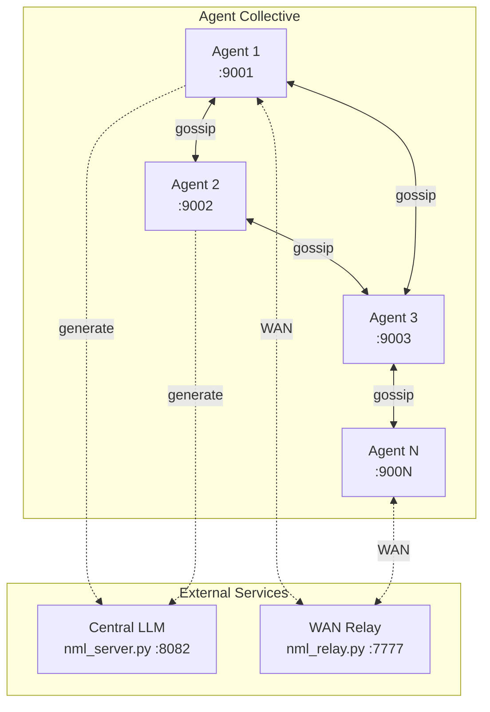
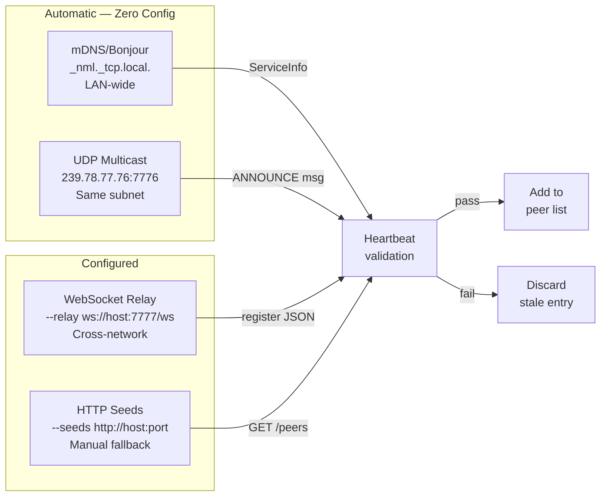
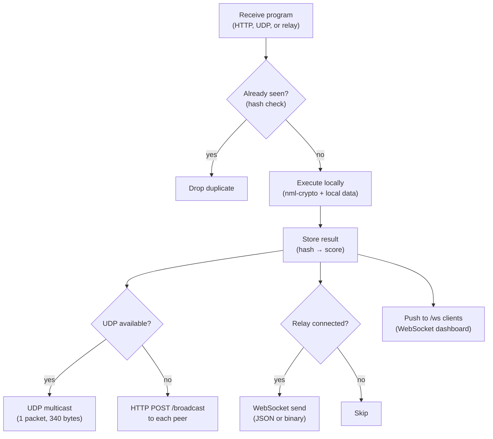
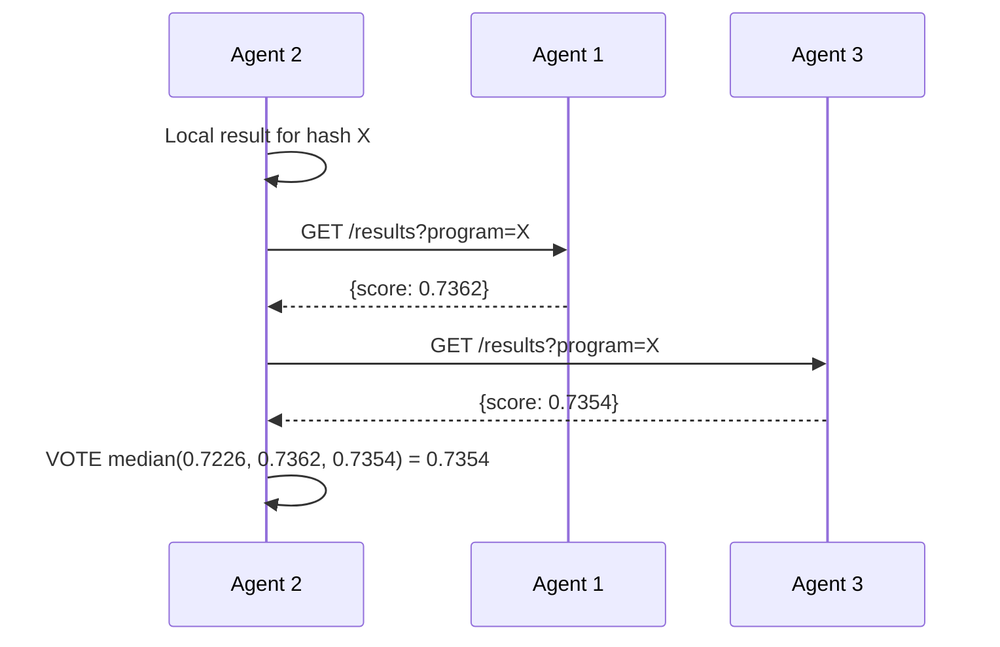
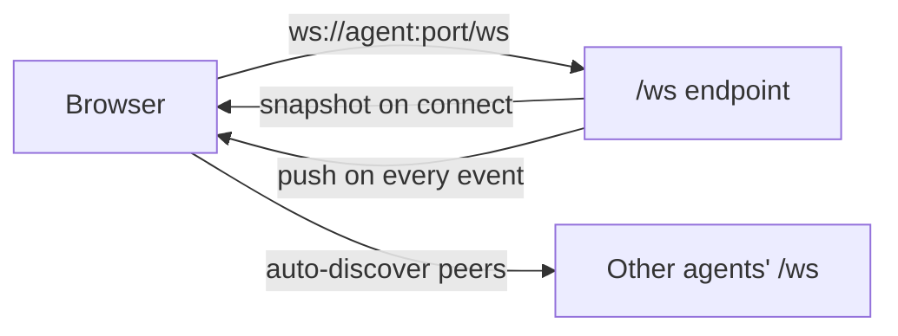
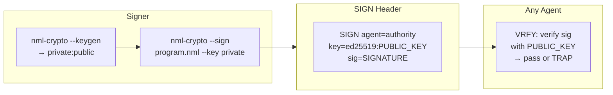

# NML Collective — Architecture

## Overview

The NML Collective is a decentralized agent mesh where autonomous peers discover each other, broadcast signed NML programs, execute them locally, and reach consensus — with no central orchestrator.



**Key principle:** Every agent is identical. There is no leader, no hub, no single point of failure. Kill any agent and the rest continue operating.

---

## Discovery Protocol

Agents use four discovery layers simultaneously. The first one that succeeds adds the peer.



### mDNS/Bonjour

- Registers `{name}._nml._tcp.local.` with `host_ttl=10, other_ttl=10` (10-second expiry)
- Uses `AsyncZeroconf` + `AsyncServiceBrowser` for non-blocking discovery
- On discovery: resolves address, then **heartbeat-validates** before trusting
- On shutdown: sends mDNS goodbye via `atexit` + `SIGTERM`/`SIGINT` handlers

### UDP Multicast

- Multicast group: `239.78.77.76:7776`, TTL=2
- ANNOUNCE messages broadcast every 5 seconds
- Also carries full NML programs (compact form, single packet)
- Latency: **11 µs median** (vs 127 µs HTTP)

### WebSocket Relay (WAN)

- Agent connects outbound to relay (NAT-friendly)
- Relay forwards all messages to all connected agents
- Same message format as UDP (binary) or JSON (structured)
- Reconnects with 5-second backoff

### HTTP Seeds

- `GET /peers` returns the full peer list as JSON
- `POST /peer/join` announces self to seed
- Fallback for networks where multicast and mDNS don't reach

---

## Broadcast Protocol

When an agent receives a program (via `/submit`, `/broadcast`, or UDP), it follows this flow:



### Deduplication

Programs are identified by `SHA-256(program)[:16]` (first 16 hex chars). Once a hash is seen, the program is never re-executed or re-forwarded.

### Epidemic Broadcast

Every agent forwards to all peers except the source. With N agents, the program reaches all nodes in O(log N) hops (epidemic spreading). UDP multicast reaches the entire subnet in one hop.

---

## UDP Packet Format

NML programs are compact enough to fit in a single UDP packet.

```
┌─────────┬──────┬──────────┬────────┬──────────┬──────────────────────┐
│ Magic   │ Type │ Name Len │  Name  │  Port    │  Payload             │
│ 4 bytes │ 1 B  │  1 B     │  N B   │  2 B     │  variable            │
│ NML\x01 │      │          │        │ big-end  │                      │
└─────────┴──────┴──────────┴────────┴──────────┴──────────────────────┘
```

| Message Type | Code | Payload |
|-------------|------|---------|
| ANNOUNCE | 1 | (empty) |
| PROGRAM | 2 | Compact NML (pilcrow-delimited) |
| RESULT | 3 | `{hash}:{score}` |
| HEARTBEAT | 4 | (empty) |

### Size Example

| | Classic | Symbolic Compact | UDP Packet |
|---|---|---|---|
| Fraud detection (23 instr) | 1,985 B | 340 B | 384 B |
| Fits in 1 UDP packet? | No | **Yes** | **Yes** |

---

## Consensus (VOTE)

Any agent can initiate consensus:



Strategies: `median` (default), `mean`, `min`, `max`.

---

## WebSocket Dashboard

Every agent serves a real-time dashboard at `/dashboard`.



- **On connect:** sends full state snapshot (peers, programs, results, events)
- **On event:** pushes incremental update (peer join/leave, program broadcast, execution result)
- **Multi-agent:** dashboard opens WebSocket to each discovered agent
- **Reconnect:** 3-second backoff on disconnect
- **Auto-connect:** `/dashboard` injects the agent's own URL, no manual entry needed

---

## Signing and Verification

Programs are signed before distribution. The NML runtime verifies before execution.



- **Ed25519:** Private key stays local. Only public key in the header. 64-byte signature.
- **HMAC-SHA256:** Backward-compatible for trusted networks. Shared key in header.
- **Tamper detection:** Any modification to the program body invalidates the signature.

---

## File Structure

```
serve/
  nml_collective.py    — Autonomous gossip agent (main entry point)
  nml_relay.py         — WebSocket relay for WAN
  nml_agent.py         — Hub-and-spoke agent (legacy, backward compat)

dashboard/
  nml_collective_dashboard.html  — Single-file web UI (HTML+JS+CSS)

demos/
  collective_demo.sh             — Start 3 agents + dashboard
  distributed_fraud.sh           — Sign + distribute + train + vote + patch
  fraud_detection.nml            — Example program
  fraud_detection_symbolic.nml   — Same program, 340 bytes compact
  fraud_detection.nml.data       — Training + test data
  agent{1,2,3}.nml.data          — Regional agent data

docs/
  ARCHITECTURE.md                — This document
```

---

## Dependencies

| Dependency | Purpose | Required? |
|-----------|---------|-----------|
| [NML runtime](https://github.com/dnamaz/nml) | `nml-crypto` binary for execution + signing | Yes |
| Python 3.10+ | Agent runtime | Yes |
| aiohttp | HTTP server + WebSocket | Yes |
| zeroconf | mDNS/Bonjour discovery | Optional |
