# NML Collective — End to End

## The Eight Roles

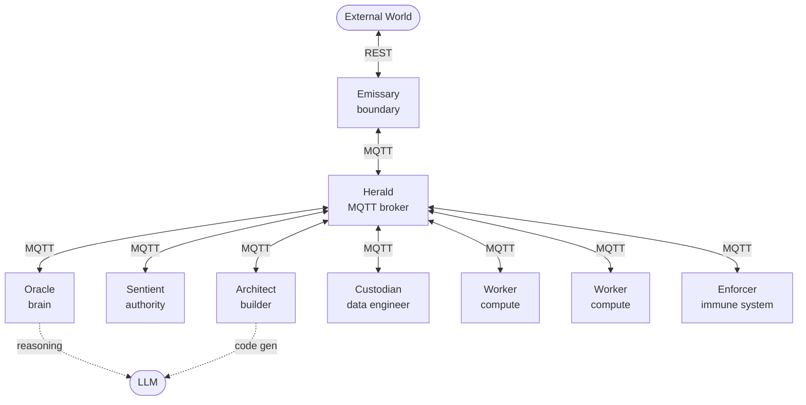

| Role | One-line | Thinks? |
|------|----------|---------|
| **Oracle** | The brain — intent, reasoning, data specs, assessment, vote initiation | Yes |
| **Sentient** | Authority — signs programs, approves data, trust anchor | No — acts on Oracle recommendation |
| **Worker** | Compute — executes programs on local data, reports scores | No — runs what it's told |
| **Architect** | Builder — generates NML programs from Oracle specs | No — builds what the spec says |
| **Custodian** | Data engineer — transforms raw data into tensors, manages Nebula lifecycle | No — shapes data to Oracle spec |
| **Enforcer** | Immune system — identity, rate limits, quarantine | No — applies rules mechanically |
| **Herald** | Infrastructure — MQTT broker, credentials, ACLs | No — routes what's published |
| **Emissary** | Boundary — receives requests, delivers answers, federation | No — passes in, delivers out |

One brain. Seven pairs of hands.

---

## Standing Orders

The Oracle does not need to be consulted on every decision. It issues **standing orders** — pre-authorized policies that other roles can act on without waiting for the Oracle.

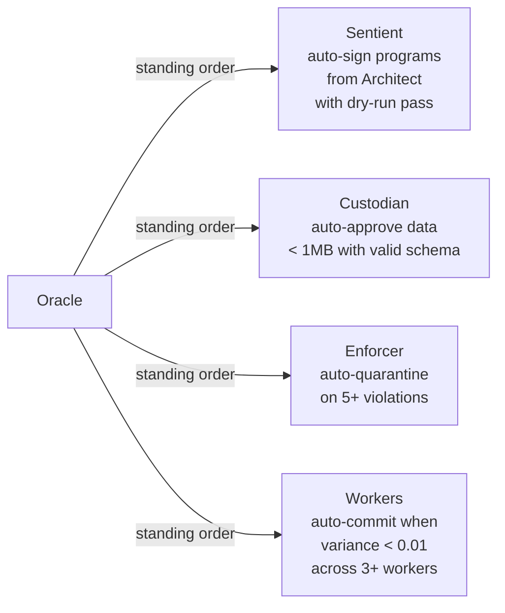

Standing orders handle the 90% case. The Oracle only gets involved for exceptions — novel requests, outlier scores, unknown data domains, ambiguous intent.

---

## End to End: "Who Will Win March Madness?"

### Phase 1 — Request Intake

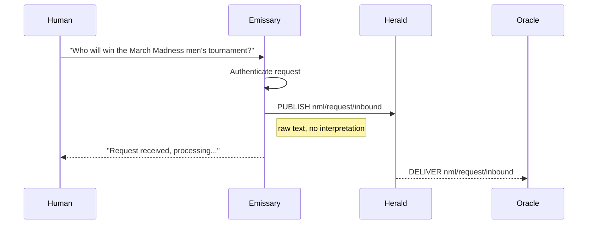

The Emissary does not interpret. It authenticates, acknowledges, and passes the raw request to the mesh. The Oracle picks it up.

### Phase 2 — Oracle Decomposes Intent

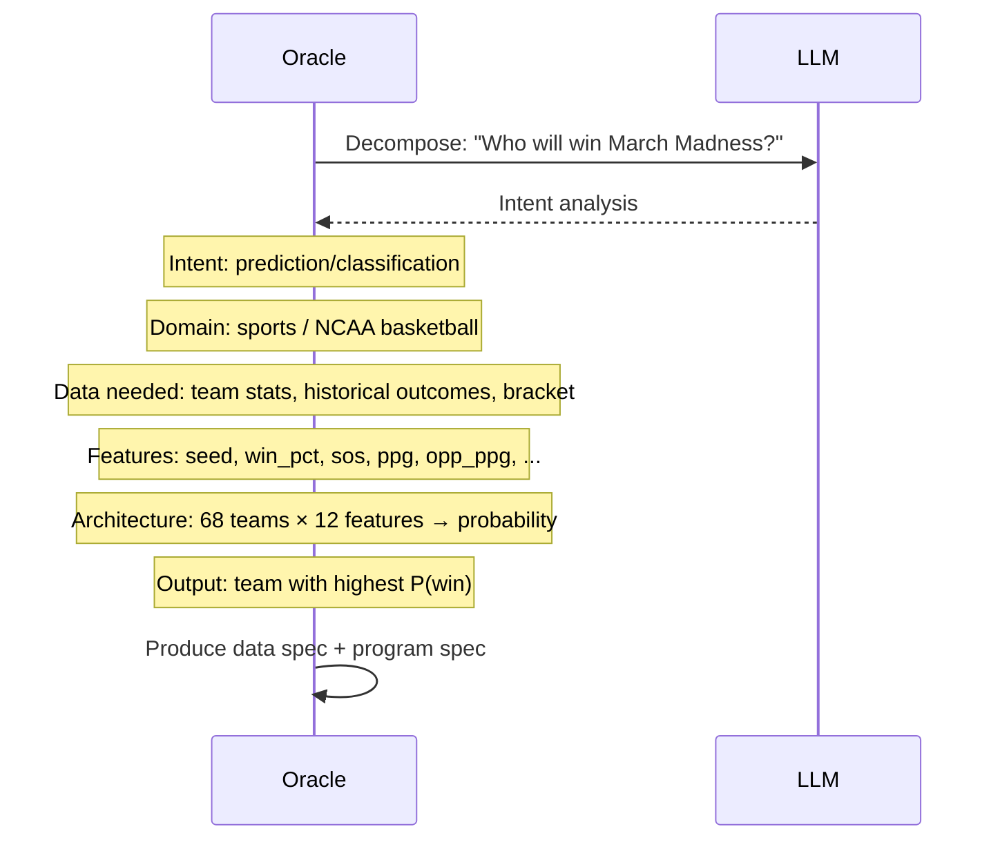

The Oracle is the only role that reasons about *what to do*. It produces two outputs:

**Data spec** (for Custodian):
```
domain: "ncaa_basketball_2026"
sources: ["team_season_stats", "historical_tournament", "current_bracket"]
shape: [68, 12]
dtype: float32
features: [seed, win_pct, sos, ppg, opp_ppg, rpg, apg, topg, ftpct, fg3pct, sos_rank, rpi]
```

**Program spec** (for Architect):
```
intent: "predict tournament winner"
architecture: "12→16→8→1"
training: "supervised, historical outcomes"
inference: "rank 68 teams by P(win)"
output_key: "win_probability"
```

### Phase 3 — Data Acquisition

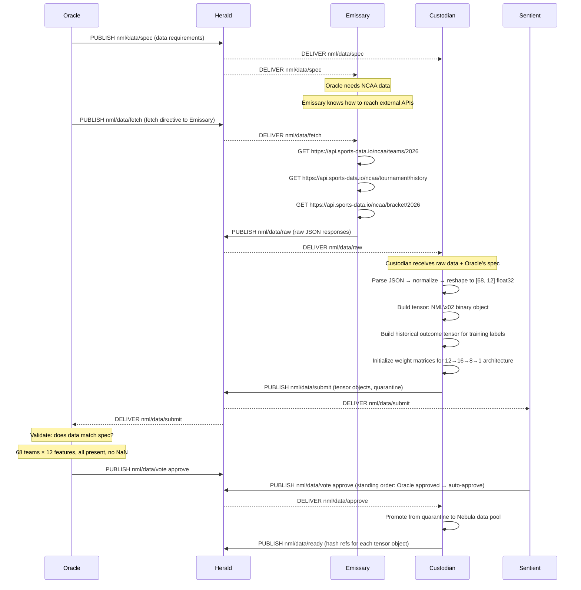

### Phase 4 — Program Generation

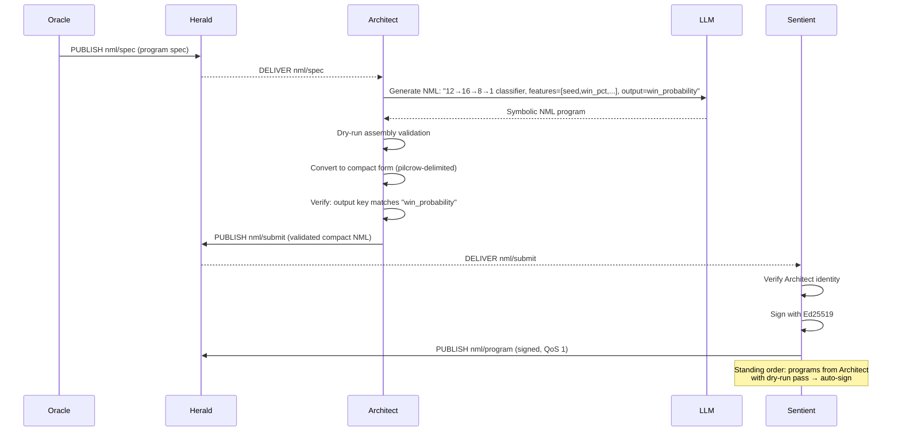

### Phase 5 — Execution

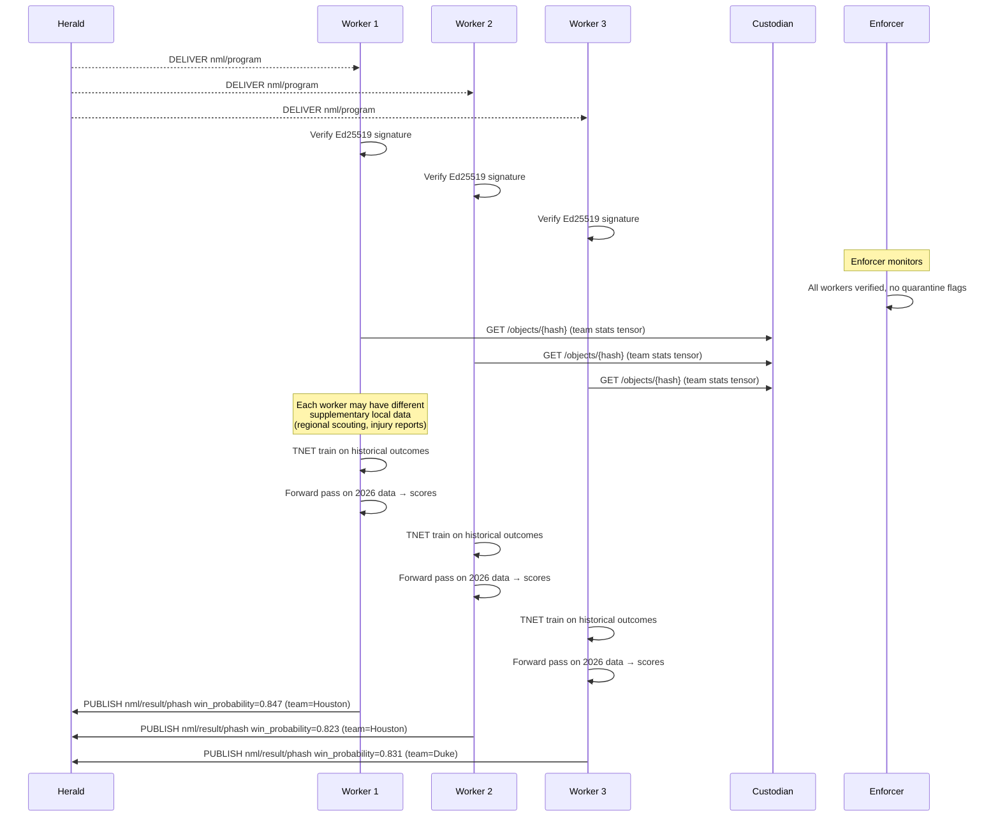

### Phase 6 — Vote and Consensus

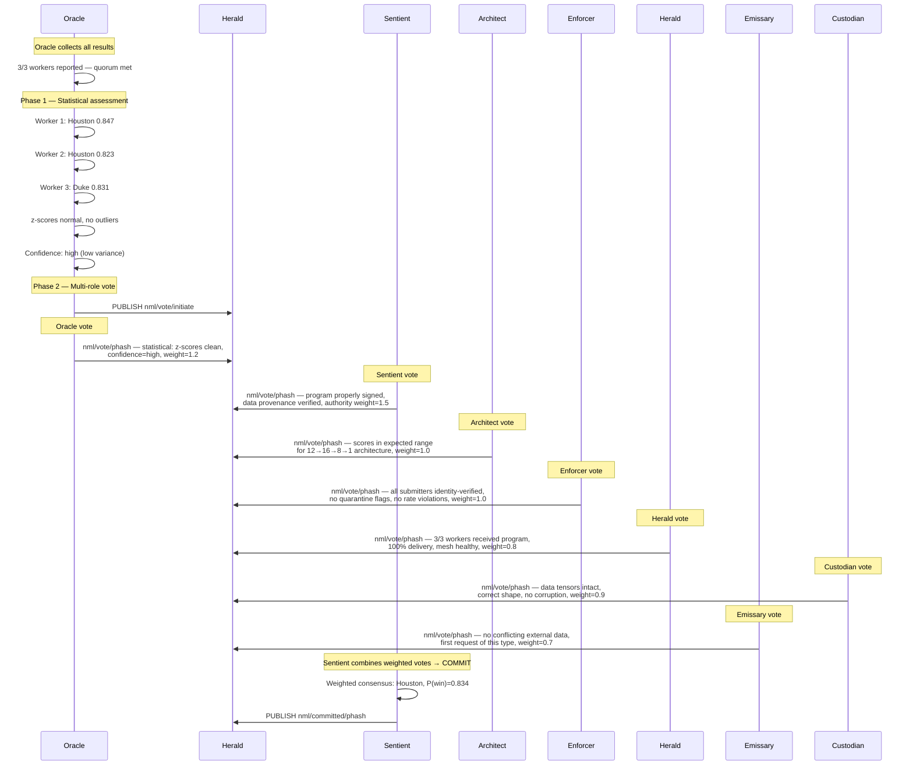

### Phase 7 — Result Delivery

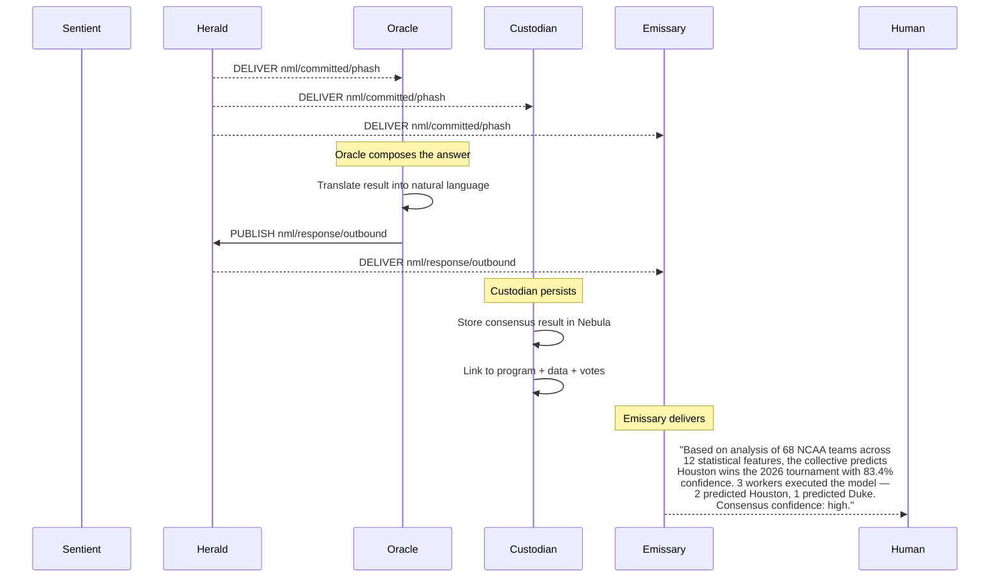

---

## The Complete Pipeline — Summary

```mermaid
flowchart TD
    subgraph intake [1. Intake]
        H1["Human asks question"]
        E1["Emissary receives + authenticates"]
    end

    subgraph think [2. Think]
        O1["Oracle decomposes intent"]
        O2["Oracle produces data spec + program spec"]
    end

    subgraph acquire [3. Acquire]
        EM1["Emissary fetches external data"]
        C1["Custodian transforms → tensors"]
        C2["Custodian submits to quarantine"]
        OS["Oracle + Sentient approve data"]
        C3["Custodian promotes to Nebula"]
    end

    subgraph build [4. Build]
        A1["Architect generates NML from spec"]
        A2["Architect validates (dry-run)"]
        S1["Sentient signs program"]
    end

    subgraph execute [5. Execute]
        H2["Herald distributes to workers"]
        W1["Workers fetch data from Nebula"]
        W2["Workers execute + score"]
    end

    subgraph consensus [6. Consensus]
        O3["Oracle initiates vote"]
        ALL["All 8 roles vote\neach with own criteria"]
        S2["Sentient commits weighted result"]
    end

    subgraph deliver [7. Deliver]
        O4["Oracle composes answer"]
        C4["Custodian persists to Nebula"]
        E2["Emissary delivers to human"]
    end

    intake --> think --> acquire --> build --> execute --> consensus --> deliver
```

---

## Oracle Scaling

The Oracle is the single reasoning layer but not a single point of failure.

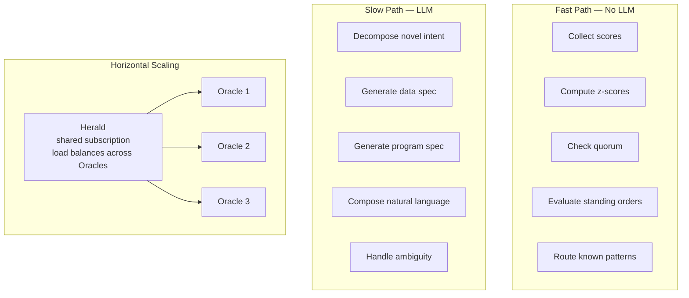

| Path | Needs LLM | Latency | Frequency |
|------|-----------|---------|-----------|
| Score collection + z-score | No | Microseconds | Every result |
| Quorum check | No | Microseconds | Every result |
| Standing order evaluation | No | Milliseconds | Every data/program submission |
| Known intent pattern | No | Milliseconds | Repeated queries |
| Novel intent decomposition | Yes | Seconds | First time per domain |
| Natural language response | Yes | Seconds | Per external request |

90% of Oracle work is the fast path. The LLM only fires for genuinely novel situations.

---

## Failure Modes

| What fails | Impact | Recovery |
|-----------|--------|----------|
| One Worker | Fewer scores, still reaches quorum | Other workers continue |
| One Oracle | Others pick up load (shared subscription) | Scale back up |
| All Oracles | No new reasoning, standing orders still work | Restart Oracle |
| Sentient | No new signatures, no commits | Existing programs keep running |
| Architect | No new programs | Existing programs keep running |
| Custodian | No new data, workers use cached tensors | Restart Custodian |
| Enforcer | No quarantine enforcement, mesh runs open | Restart Enforcer |
| Herald | All MQTT traffic stops | Restart broker (auto-supervised) |
| Emissary | No external access, internal mesh continues | Restart Emissary |
| LLM | Oracle fast path works, slow path queues | Queue until LLM returns |
