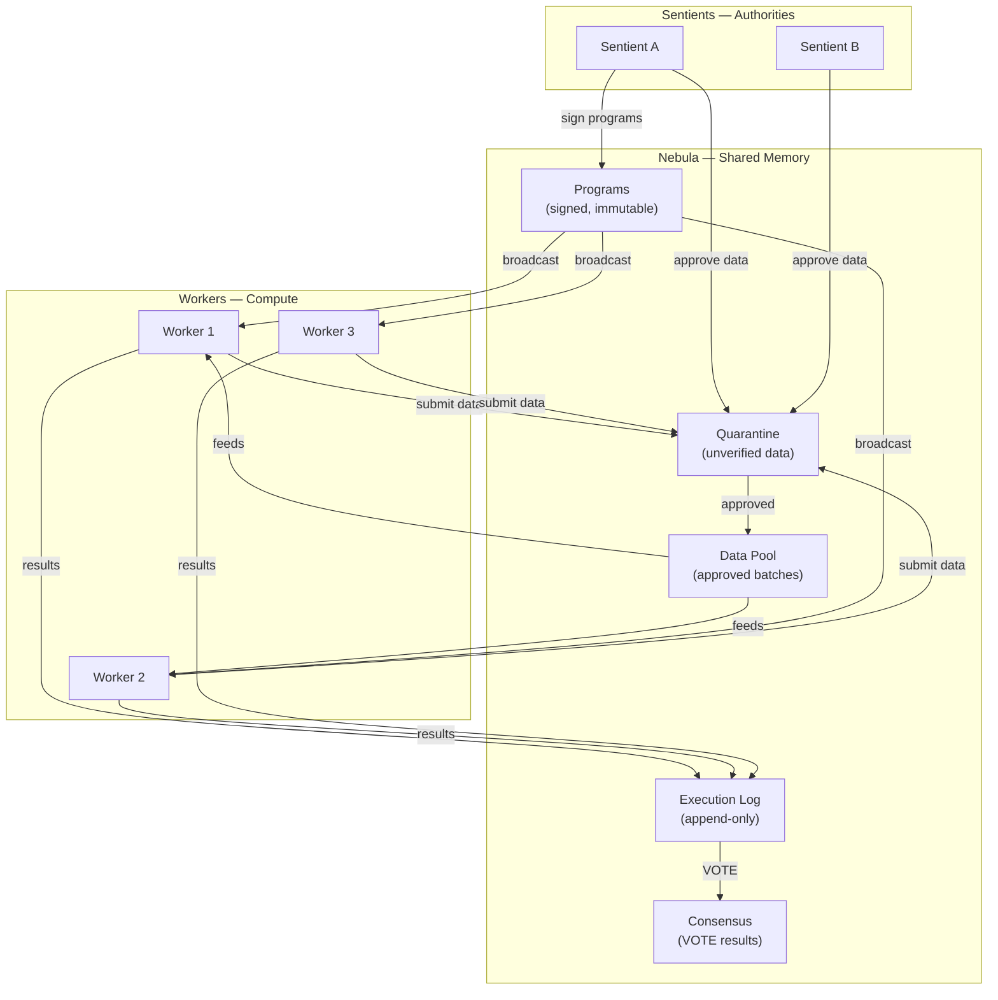
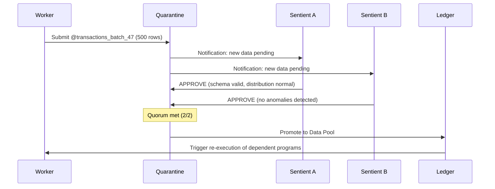
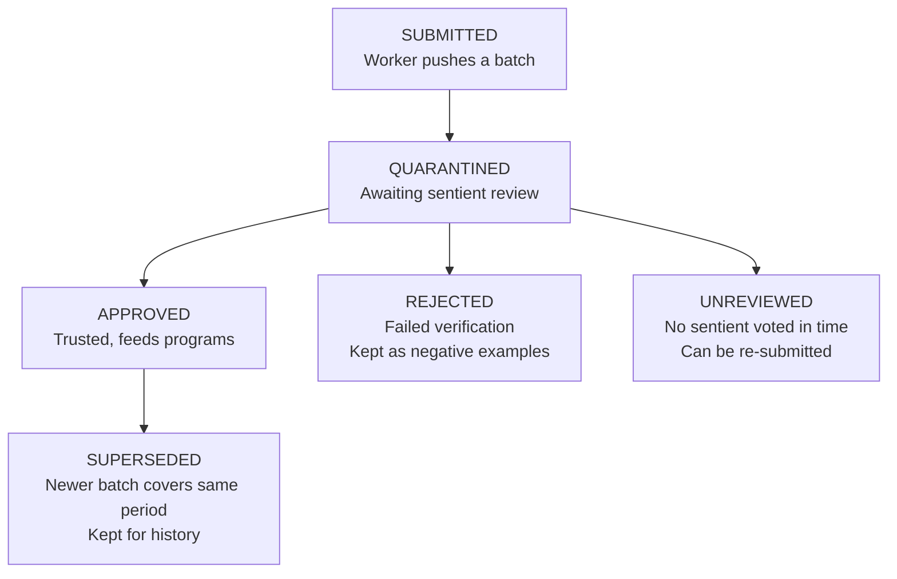
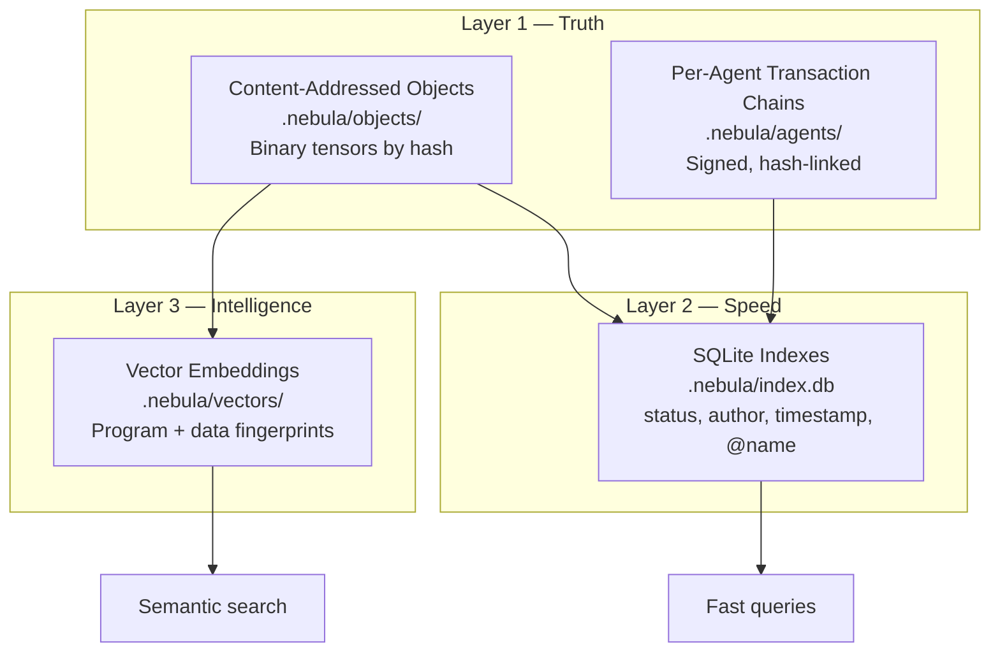

# Nebula — The Collective's Brain

## Overview

The Nebula is the shared memory, data store, and coordination layer at the center of the NML Collective. It holds signed programs, approved data, execution results, and consensus — while agents orbit around it, contributing observations and computation.

The Nebula is not a single server. It's a distributed ledger replicated across sentient agents, with workers contributing data and compute.



---

## Design Decision 1: Who Writes

### Roles

**Sentients** — the authorities of the collective.
- Sign and publish programs to the ledger
- Approve or reject data in quarantine via VOTE
- Define data manifests (what data feeds which program)
- Can promote/demote workers

**Workers** — the compute nodes.
- Submit observed data to quarantine (never directly to the ledger)
- Execute approved programs with approved data
- Report execution results
- Cannot modify programs or approve their own submissions

### Write Flow



### Quarantine

All ingested data enters quarantine — untrusted by default. Data is submitted by the Custodian (which handles JSON/CSV → FLOAT32 conversion, sharding, and manifests) and sits in quarantine until sentients vote on it.

```
Quarantine Entry {
  hash:          content-addressed SHA-256
  submitted_by:  custodian name + signature
  submitted_at:  timestamp
  content:       @name + shape + data
  status:        pending | approved | rejected | unreviewed
  votes:         [{sentient, vote, reason}]
  auto_checks:   schema_match, bounds_check, null_check
  policy:        {quorum: majority, expires: 3600s}
}
```

**Auto-checks** run immediately on submission:
- Schema matches what the program expects
- Values within expected bounds
- No nulls or NaN

Auto-checks that pass fast-track sentient review. Auto-checks that fail can auto-reject.

---

## Design Decision 2: Data Is Additive

### No Conflicts, No Merging

Two datasets ingested from different sources is not a conflict — it's more data. The collective doesn't need agreement on data. It needs agreement on results.

```
Custodian ingests: @transactions_us_east     (500 rows)
Custodian ingests: @transactions_europe      (300 rows)
Custodian ingests: @transactions_asia        (200 rows)

These are three separate contributions.
No merge. No ownership. No conflict.
```

### Diverse Perspectives Strengthen Consensus

Each agent trains on different data. Each produces a different score. VOTE combines diverse perspectives into a consensus that's stronger than any individual:

```
Program: fraud_detection.nml (same for everyone, signed)
Agent A: trains on US data     → score 0.73
Agent B: trains on EU data     → score 0.68
Agent C: trains on Asia data   → score 0.81
VOTE median: 0.73

The diversity IS the value.
```

### Data Manifests

When a sentient wants specific data to feed a program, they create a signed manifest:

```
Manifest {
  program:         sha256:958c21...
  signed_by:       sentient_A
  data_bindings: {
    @training_data:   [batch_12, batch_13, batch_14]  (CONCAT)
    @training_labels: [labels_12, labels_13, labels_14]
    @new_transaction: latest_flagged
  }
}
```

Workers receive the manifest, resolve references from the data pool, and execute. The program never changes — only the manifest changes.

---

## Design Decision 3: Nothing Expires

### Classify, Don't Delete

Data doesn't expire. It gets classified:



### Bad Data Trains the Guards

Rejected data is not garbage — it's a signal:

- A poisoning attempt teaches the collective what attacks look like
- A malfunctioning sensor's output trains anomaly detection
- Distribution anomalies become features for the quarantine auto-checker

The collective can train a meta-program:

```
anomaly_detector.nml
  Trained on: REJECTED batches (positive) + APPROVED batches (negative)
  Purpose: auto-flag suspicious submissions in quarantine
  Becomes: an automated sentient
```

The collective learns from its own rejection history. Every bad submission makes quarantine smarter.

### Storage Is Not a Problem

```
Per batch:     ~10 KB (500 rows, 6 features)
Per day:       100 batches = 1 MB
Per year:      365 MB
Per decade:    3.6 GB

Programs:      340 bytes each
Consensus:     < 1 KB each
Exec history:  200 bytes per execution
```

A Raspberry Pi can hold the full ledger for years. Tiered storage (hot/warm/cold) handles growth if needed, but deletion is never required.

### The Principle

**The collective never forgets. It classifies.**

Good data trains the models. Bad data trains the guards. Old data provides context. Every rejection makes the system smarter.

---

## Design Decision 4: Roles Are the Incentive

### No Tokens, No Credits, No Marketplace

A worker doesn't need a reward for executing programs any more than a neuron needs a reward for firing. It's what it does. The collective is an organism, not a marketplace.

- A sentient approves because that's its function
- A worker computes because that's its function
- The nebula stores because that's its function

If a component stops doing its job, the collective detects it (heartbeat failure) and compensates (other agents pick up the work). There's no punishment — just natural selection. Healthy agents persist; dead agents are forgotten.

### Health Over Incentives

Instead of rewards, monitor health:

```
Sentient health:
  - Review latency (how fast do they vote on quarantine?)
  - Approval rate (are they rubber-stamping or actually reviewing?)
  - Uptime

Worker health:
  - Submission quality (what % of their data passes auto-checks?)
  - Execution reliability (do they complete programs?)
  - Heartbeat consistency
  - Agreement with consensus (do their scores align with VOTE?)
```

Workers that consistently disagree with consensus may be malfunctioning. Sentients that never reject anything aren't adding value. The collective tracks health, not balance sheets.

---

## Ledger Structure

Every object in the nebula is content-addressed (hash = identity):

```
Ledger Entry {
  type:       program | data | execution | consensus | manifest
  hash:       SHA-256 of content
  prev_hash:  chain integrity (optional, for ordering)
  timestamp:  when created
  author:     agent name + Ed25519 public key
  signature:  Ed25519 of (hash + timestamp + content)
  status:     approved | rejected | pending | superseded
  content:    the payload
}
```

The ledger is **append-only**. Nothing is modified or deleted. New entries reference old ones (prev_hash) to maintain ordering and integrity.

---

## Storage Architecture

Three layers, each building on the one below. Only Layer 1 is the source of truth.



### Layer 1: Truth

**Content-addressed tensor objects** (`serve/nml_storage.py: NebulaDisk`):
- Every program, data batch, and manifest stored as binary files
- Filename = SHA-256 hash of content (first 2 chars as subdirectory)
- Binary format: `NML\x02` magic + hash + type + author + timestamp + shape + dtype + content
- Immutable: once written, never modified or deleted

**Per-agent transaction chains** (`serve/nml_storage.py: TransactionLog`):
- Each agent has an append-only binary log: `.nebula/agents/{name}/chain.binlog`
- Each transaction: `tx_id + hash + prev_hash + timestamp + agent + type + refs + content`
- Hash chain: `hash = SHA-256(prev_hash + type + content + timestamp)`
- Self-verifying: walk the chain, recompute hashes, any mismatch = tampering
- Cross-agent refs create a DAG — mutual accountability across agents

Transaction types:
```
0x01 AGENT_JOIN       0x10 PROGRAM_PUBLISH    0x20 DATA_SUBMIT
0x02 AGENT_LEAVE      0x11 PROGRAM_BROADCAST  0x21 DATA_APPROVE
                                               0x22 DATA_REJECT
0x30 EXECUTION        0x31 CONSENSUS          0x40 MANIFEST_CREATE
```

### Layer 2: Speed

**SQLite indexes** (`serve/nml_storage.py: NebulaIndex`):
- Single file: `.nebula/index.db`
- Tables: `objects`, `transactions`, `executions`, `consensus`
- Indexes on: status, name, author, timestamp, program_hash
- Derived from Layer 1 — rebuildable if lost

### Layer 3: Intelligence

**Vector embeddings** (`serve/nml_storage.py: NebulaVectors`):
- Programs: embedded by opcode histogram (82 dimensions)
- Data: embedded by statistical signature (mean, std, min, max per feature)
- Stored as 64-dim float32 vectors (256 bytes each)
- Similarity search: find programs like X, find data compatible with program Y
- Meta-circular: the collective can use NML programs to compute its own embeddings

### Disk Layout

```
.nebula/
  objects/
    95/8c212fb9240ba3.obj     binary program
    08/9405d94f196663.obj     binary data batch
    3b/be64393e2c8fa9.obj     binary data batch
  agents/
    oracle/chain.binlog       sentient's transaction chain
    worker_1/chain.binlog     worker's chain
    worker_2/chain.binlog     worker's chain
  vectors/
    958c212fb9240ba3.vec      program embedding (256 bytes)
    089405d94f196663.vec      data embedding (256 bytes)
  index.db                    SQLite (derived, rebuildable)
```

### Scale

| Scale | Objects | Chains | Index | Vectors | Total |
|-------|---------|--------|-------|---------|-------|
| 1K batches | 10 MB | 1 MB | 100 KB | 1 MB | ~12 MB |
| 100K batches | 1 GB | 100 MB | 10 MB | 100 MB | ~1.2 GB |
| 10M batches | 100 GB | 10 GB | 1 GB | 10 GB | ~121 GB |

A Raspberry Pi can hold the full ledger for years. Only at 10M+ batches does sharding become necessary.

### API Endpoints

| Endpoint | Method | Purpose |
|----------|--------|---------|
| `/ledger?agent=X` | GET | View an agent's transaction chain |
| `/ledger/verify?agent=X` | GET | Verify chain integrity |
| `/data/similar?hash=X` | GET | Find data similar to X (vector search) |
| `/data/compatible?program=X` | GET | Find data compatible with program X |
| `/storage` | GET | Disk, index, and vector stats |

---

## Implementation Plan

### Phase 1: Nebula Core (`serve/nml_nebula.py`)
- Content-addressed store (programs, data, executions, consensus)
- Quarantine with auto-checks
- Approval VOTE endpoint for sentients
- Data pool queries
- Execution trigger on data approval

### Phase 2: Agent Roles
- `--role sentient` and `--role worker` flags
- Workers: `/submit-data` → quarantine
- Sentients: `/approve` and `/reject` with reasons
- Manifests: sentient signs data bindings for a program

### Phase 3: Re-execution
- When new data is approved, trigger re-execution of dependent programs
- Agents pull program from cache + data from pool
- New scores → new VOTE → updated consensus

### Phase 4: Dashboard
- Nebula visualization shows quarantine inbox, data pool, execution timeline
- Sentient view: pending approvals, vote buttons
- Worker view: submission status, execution queue
