# NML Collective — Roles

## Voting

Every role votes. The execution score is one input — each role also brings its own criteria, and the combination of all perspectives is what makes consensus meaningful.

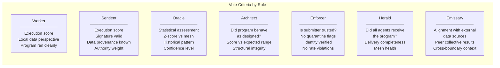

The score value is a signal. Trust, provenance, delivery, structure, and external alignment are the other signals. A high score from an untrusted node carries less weight than the same score from a verified one.

---

## Collective Overview

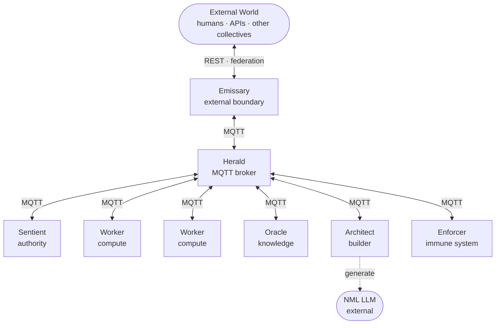

---

## Sentient

```mermaid
flowchart LR
    subgraph inputs [Receives]
        i1["nml/submit\nprogram from Architect"]
        i2["nml/data/submit\ndata from workers"]
        i3["nml/data/vote\nOracle approval"]
        i4["Enforcer --approve\nblacklist decision"]
    end

    subgraph sentient [Sentient]
        s1["Sign programs\nEd25519 private key"]
        s2["Own Nebula ledger\nbinary object store"]
        s3["Finalize data\nout of quarantine"]
        s4["Issue MQTT credentials\nvia Herald"]
        s5["Approve blacklists\nonly Sentient can"]
        s6["Serve data over HTTP\nfor worker fetch"]
        s7["Vote on consensus\nscore + signature valid\n+ data provenance\n+ authority weight"]
    end

    subgraph outputs [Publishes]
        o1["nml/program\nsigned program to workers"]
        o2["nml/committed/phash\nfinal consensus result"]
    end

    inputs --> sentient --> outputs
```

**Special protections:** Enforcers cannot quarantine a Sentient. Blacklist decisions require Sentient approval. Only Sentients hold Ed25519 private keys — all other roles verify only.

---

## Worker

```mermaid
flowchart LR
    subgraph inputs [Receives]
        i1["nml/program\nsigned NML program"]
        i2["nml/enforce\nquarantine decisions"]
        i3["--data FILE or\n--data-name NAME"]
    end

    subgraph worker [Worker]
        w1["Verify Ed25519 signature\nreject if invalid"]
        w2["Check sender quarantine\nrefuse quarantined programs"]
        w3["Fetch data on demand\nGET /objects from Sentient"]
        w4["Execute NML in-process\nTNET train + infer"]
        w5["Report score\nUDP or MQTT result"]
        w6["Vote on consensus\nexecution score\n+ local data perspective\n+ program ran cleanly"]
    end

    subgraph outputs [Publishes]
        o1["nml/result/phash\nhash:score"]
    end

    inputs --> worker --> outputs
```

---

## Oracle

```mermaid
flowchart LR
    subgraph inputs [Receives]
        i1["nml/result/#\nexecution scores"]
        i2["nml/announce/#\npeer presence"]
        i3["nml/heartbeat/#\nagent health"]
        i4["nml/data/submit\ndata quality review"]
    end

    subgraph oracle [Oracle]
        o1["Observe all agents\nand events"]
        o2["Two-phase VOTE\ncollect + assess scores"]
        o3["Z-score outlier detection\nper-agent confidence weights"]
        o4["Vote on data quality\nduring quarantine review"]
        o5["Generate program specs\nforward to Architect"]
        o6["Answer questions\nabout collective state"]
        o7["Vote on consensus\nstatistical assessment\n+ z-score vs mesh\n+ historical pattern\n+ confidence level"]
    end

    subgraph outputs [Publishes]
        p1["nml/assess/phash\nconfidence · weights · outliers"]
        p2["nml/spec\nprogram spec to Architect"]
        p3["nml/data/vote\napprove or reject data"]
    end

    inputs --> oracle --> outputs
```

---

## Architect

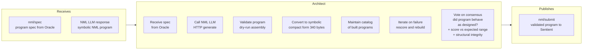

**Requires:** NML LLM endpoint (`--llm http://host:port`)

---

## Enforcer

```mermaid
flowchart LR
    subgraph inputs [Receives]
        i1["nml/announce/#\nidentity payloads"]
        i2["nml/heartbeat/#\nrate tracking"]
        i3["nml/result/#\nscore outlier detection"]
        i4["$SYS/broker/#\nbroker metrics via Herald"]
        i5["nml/enforce\ngossip from other Enforcers"]
    end

    subgraph enforcer [Enforcer]
        e1["Verify node identity\nmachine_hash + node_id"]
        e2["Enforce one-node-per-machine\ndetect name spoofing"]
        e3["Rate limit\n20 msgs per 60s"]
        e4["Z-score outlier detection\n3 outliers in 1h → quarantine"]
        e5["Three enforcement levels\nwarn → quarantine → blacklist"]
        e6["Collect evidence\nper-agent log"]
        e7["Request credential revocation\nfrom Herald"]
        e8["Vote on consensus\nis submitter trusted?\n+ identity verified\n+ no quarantine flags\n+ no rate violations"]
    end

    subgraph outputs [Publishes]
        o1["nml/enforce\nQ quarantine · U unquarantine · W warn"]
        o2["Herald /credentials/revoke\nHTTP credential revocation"]
    end

    inputs --> enforcer --> outputs
```

**Cannot quarantine Sentients.** Blacklists require Sentient approval via `--approve`.

---

## Herald

```mermaid
flowchart LR
    subgraph inputs [Receives]
        i1["Sentient\ncredential issuance request"]
        i2["Enforcer\ncredential revocation request"]
        i3["$SYS/broker/#\nbroker self-reporting"]
    end

    subgraph herald [Herald]
        h1["Supervise MQTT broker\nMosquitto or EMQX"]
        h2["Restart broker on crash\nalert mesh on failure"]
        h3["Issue client credentials\nusername/password or TLS cert"]
        h4["Revoke credentials\nimmediate effect on reconnect"]
        h5["Manage topic ACLs\nwho publishes to what"]
        h6["Monitor $SYS metrics\nclients · rates · queue depth"]
        h7["Configure bridge\nmulti-site federation"]
        h8["Vote on consensus\ndid all agents receive\nthe program?\n+ delivery completeness\n+ mesh health at time of run"]
    end

    subgraph outputs [Publishes]
        o1["nml/herald/status\nbroker health summary"]
    end

    inputs --> herald --> outputs
```

**Note:** The Herald does not participate in consensus, execution, or data decisions. It is pure infrastructure — all agent traffic flows through it.

---

## Emissary

```mermaid
flowchart LR
    subgraph inputs [Receives From Outside]
        i1["Human operator\nREST API requests"]
        i2["Other collective\nfederation handshake"]
        i3["External data source\ndata ingestion"]
        i4["nml/committed/#\nresults to export"]
    end

    subgraph emissary [Emissary]
        e1["Authenticate all\nexternal parties"]
        e2["Serve REST API\nand dashboard"]
        e3["Forward programs\nto Sentient via MQTT"]
        e4["Forward data\nto Sentient for quarantine"]
        e5["Export results\nwebhooks · SSE · REST"]
        e6["Federation bridge\nmutual identity verify"]
        e7["Rate limit and log\nall external traffic"]
        e8["Vote on consensus\nalignment with external\ndata sources\n+ peer collective results\n+ cross-boundary context"]
    end

    subgraph outputs [Sends Outside]
        o1["HTTP responses\nto human operators"]
        o2["Webhook delivery\nto downstream consumers"]
        o3["Federation messages\nto peer collectives"]
    end

    inputs --> emissary --> outputs
```

**Note:** No internal agent is directly reachable from outside the collective. All external traffic — human or machine — enters and exits through the Emissary.

---

## Program Lifecycle

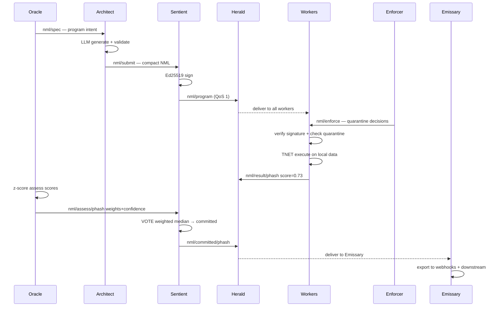

---

## Multi-Role Vote

Every role casts a vote. The score is one dimension — each role adds its own dimension to the decision.

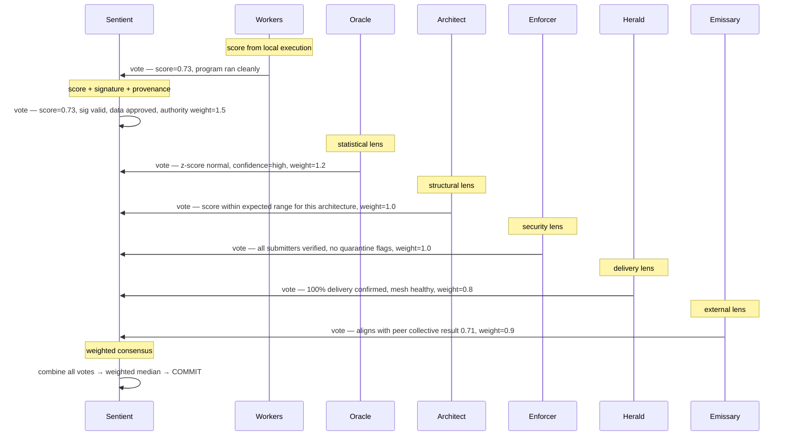

The Sentient applies weights and combines all votes into the final committed result. A node with no delivery confirmation (Herald vote low) or an unverified submitter (Enforcer vote low) drags the confidence down even if the raw score is high.

---

## Enforcement Flow

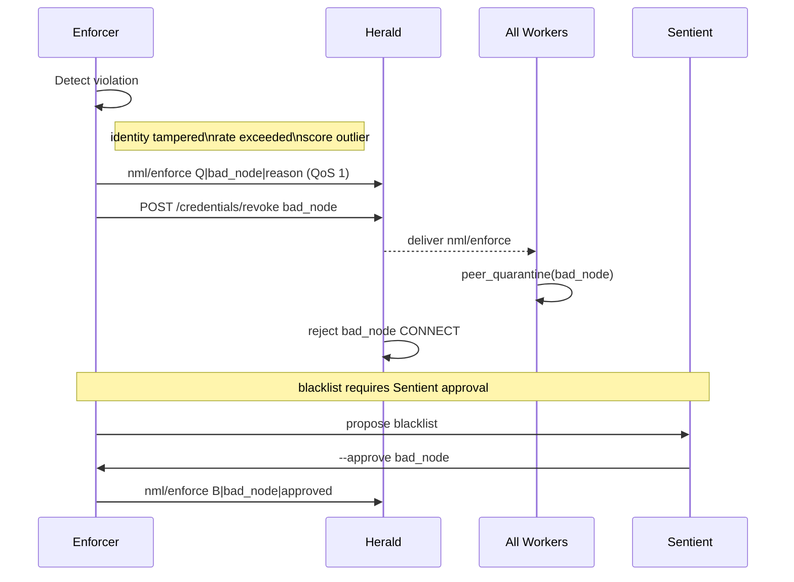
