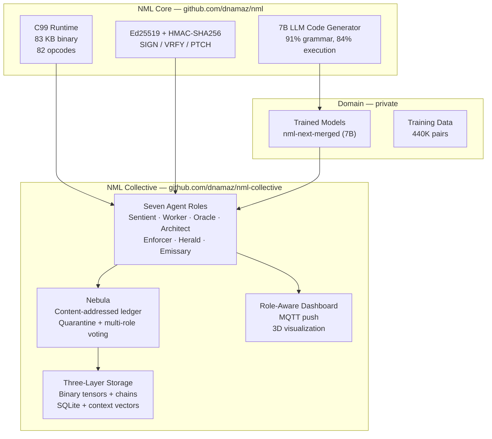
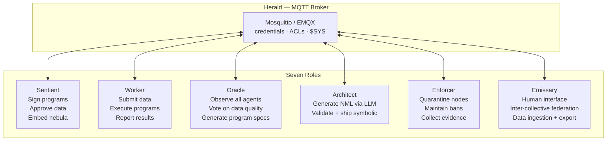
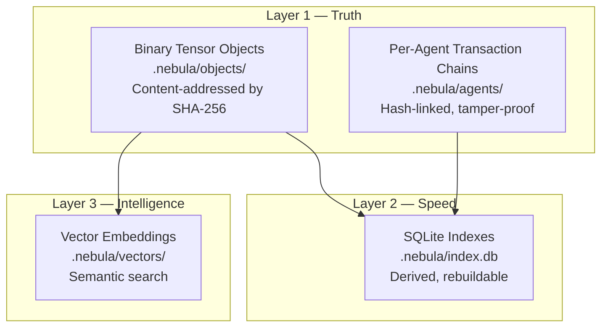
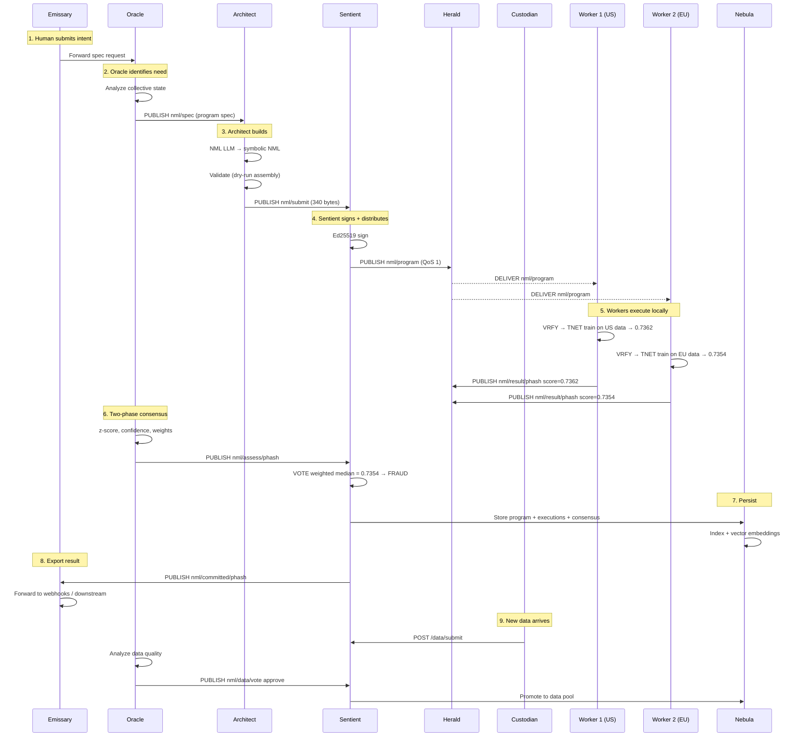

# NML System Architecture

## What This Is

A decentralized AI execution platform. Signed neural network programs — small enough to fit in a single packet — broadcast across autonomous agent meshes via MQTT, train locally on each agent's data, and reach consensus through voting. A tamper-proof ledger tracks every program, every data batch, every execution, and every decision.

Three repositories. One system.

---

## The Full Stack

From a 340-byte program to a distributed consensus — every layer:

```mermaid
flowchart LR
    subgraph program [1. Program]
        nml["23 instructions\n340 bytes compact\nTrain + Infer + Decide"]
    end
    subgraph sign [2. Sign]
        ed25519["Ed25519 signature\nPublic key in header\nPrivate key stays local"]
    end
    subgraph broadcast [3. Broadcast]
        mqtt["MQTT publish\nnml/program topic\nQoS 1 delivery"]
    end
    subgraph mesh [4. Agent Mesh]
        discover["Zero-config discovery\nMQTT retained presence\nLast Will on disconnect"]
    end
    subgraph execute [5. Execute]
        tnet["TNET local training\nForward pass\nCMPI threshold decision"]
    end
    subgraph consensus [6. Consensus]
        vote["VOTE median\nAcross all agents\nDiverse perspectives"]
    end
    subgraph persist [7. Persist]
        ledger["Nebula ledger\nBinary tensors\nHash-chained transactions\nSQLite + vectors"]
    end
    program --> sign --> broadcast --> mesh --> execute --> consensus --> persist
```

### Layer 1: The Program

An NML program is a sequence of tensor register machine instructions. The fraud detection example:

- 23 instructions: load weights, train with TNET, forward pass (MMUL → MADD → RELU → SIGM), threshold decision (CMPI → JMPF)
- 1,985 bytes in classic syntax, **340 bytes** in symbolic compact form
- Trains a 6→8→1 neural network, runs inference, and makes a binary fraud/legitimate decision
- Self-contained: the same program trains AND infers

### Layer 2: Signing

Programs are signed with Ed25519 asymmetric cryptography:

- `nml-crypto --keygen` generates a keypair (private stays local)
- `nml-crypto --sign program.nml --key private_key --agent authority` prepends a SIGN header
- Only the public key appears in the header — the private key never leaves the signer
- Any agent can verify the signature; no shared secret needed
- Tampered programs are rejected before assembly

### Layer 3: Broadcast

Signed programs distribute via MQTT through the Herald broker:

- Topic: `nml/program`, QoS 1 — guaranteed delivery to all subscribed workers
- The entire signed fraud detection program fits in **625 bytes** — one MQTT message
- Herald handles delivery, persistence for offline workers, and re-delivery on reconnect
- For cross-network: Herald broker is reachable on a stable IP/hostname — no relay needed

### Layer 4: Agent Mesh

Agents are autonomous peers that self-organize via MQTT subscriptions:

- **No orchestrator.** Every agent is a peer with a specialized role. Kill any agent and the rest continue.
- **[Sentients](ROLE_SENTIENT.md)** are authorities: they sign programs, approve data, hold the nebula
- **[Workers](ROLE_WORKER.md)** are compute: they submit data, execute programs, report results
- **[Oracles](ROLE_ORACLE.md)** are knowledge: they observe everything, vote on data quality with analysis, assess consensus, generate program specs
- **[Architects](ROLE_ARCHITECT.md)** are builders: they generate valid NML programs from specs via the NML LLM in symbolic syntax, validate by dry-run assembly
- **[Enforcers](ROLE_ENFORCER.md)** are the immune system: they quarantine compromised nodes, maintain ban lists, collect evidence, gossip enforcement across the mesh
- **[Heralds](ROLE_HERALD.md)** are mesh infrastructure: they run the MQTT broker, manage credentials and ACLs, monitor broker health, and bridge sites
- **[Emissaries](ROLE_EMISSARY.md)** are the external boundary: all human interaction, inter-collective federation, data ingestion, and result export flow through the Emissary

### Layer 5: Execution

Each agent executes the program independently with its own local data:

- TNET trains the neural network on the agent's local transaction data
- Different agents see different data (US, Europe, Asia)
- Each produces a different fraud score reflecting its local perspective
- The 83 KB C runtime handles everything: assembly, FRAG/LINK resolution, SIGN verification, training, inference

### Layer 6: Consensus

Agents don't need to agree on data — they agree on results:

- VOTE computes median (or mean, min, max) across all agent scores
- Diverse perspectives strengthen the consensus
- Agent A trained on US data (score 0.7362), Agent B on EU data (0.7226), Agent C on Asia data (0.7354)
- Median: **0.7354** — fraud detected
- No merge, no conflict resolution — the diversity IS the value

### Layer 7: Persistence

The nebula stores everything in a three-layer architecture:

- **Objects**: programs and data stored as binary files, keyed by content hash
- **Chains**: every action by every agent is logged in an append-only, hash-linked chain
- **Indexes**: SQLite for fast queries (status, author, timestamp, @name)
- **Vectors**: 64-dim embeddings for "find similar programs" and "find compatible data"
- **Nothing is deleted.** Data is classified (approved, rejected, superseded), never purged

---

## Data Flow: End to End

A complete lifecycle of a fraud detection program:

---

## Key Numbers

| Metric | Value |
|--------|-------|
| NML opcodes | 82 (35 core + 47 extensions) |
| Runtime binary | 83 KB (C99, single file) |
| Fraud detection program | 23 instructions, 340 bytes compact |
| MQTT publish latency | < 1 ms LAN (QoS 0), < 5 ms (QoS 1) |
| Signed packet size | 625 bytes (fits in 1 MQTT message) |
| TNET training speed | 166x faster than Python/NumPy |
| Inference latency | 34 us (anomaly detector) |
| Model accuracy | 91% grammar, 84% execution (89 prompts) |
| Discovery time | < 100 ms (MQTT retained messages) |
| Storage: 100K batches | ~1.2 GB across all layers |
| Vector embedding | 64 dims, 256 bytes per object |
| Transaction chain | ~200 bytes per entry, hash-linked |

---

## Repository Map

| Repo | What | Key Files |
|------|------|-----------|
| [dnamaz/nml](https://github.com/dnamaz/nml) | Core runtime + ISA + crypto | `runtime/nml.c`, `runtime/nml_crypto.h`, `runtime/tweetnacl.c` |
| [dnamaz/nml-collective](https://github.com/dnamaz/nml-collective) | Agent mesh + roles + nebula + dashboard | `serve/nml_collective.py`, `edge/`, `roles/` |
| domain/ (private) | Trained models + training data | `nml-next-merged` (7B), 440K training pairs |

---

## Design Principles

1. **Programs are tiny, data is the variable.** The same 340-byte program runs everywhere. Only the data changes. New data triggers re-execution, not new programs.

2. **No orchestrator among agents.** Agents self-discover and self-organize via MQTT. Kill any agent and the collective continues. There is no single point of failure among the agent roles.

3. **Sign once, verify everywhere.** The authority signs a program once. Every agent verifies independently. No shared secrets, no trust assumptions, no central certificate authority.

4. **Data is additive, not competitive.** Two datasets ingested from different sources isn't a conflict — it's more perspectives. VOTE consensus is stronger when workers compute over diverse data.

5. **The collective never forgets.** Data is classified (approved, rejected, superseded), never deleted. Bad data trains the guards. The ledger is append-only.

6. **Roles are the incentive.** Sentients approve because that's their function. Workers compute because that's their function. Oracles observe because that's their function. Architects build because that's their function. Enforcers protect because that's their function. Heralds route because that's their function. Emissaries bridge because that's their function. The collective is an organism, not a marketplace.

7. **Useful computation, not wasteful mining.** Unlike blockchain proof-of-work, every cycle of computation produces actual value — a fraud score, a risk assessment, a trained model.

8. **One boundary, clearly drawn.** No internal agent is directly reachable from outside the collective. All external traffic — human or machine — enters through the Emissary. The internal mesh is not exposed.
